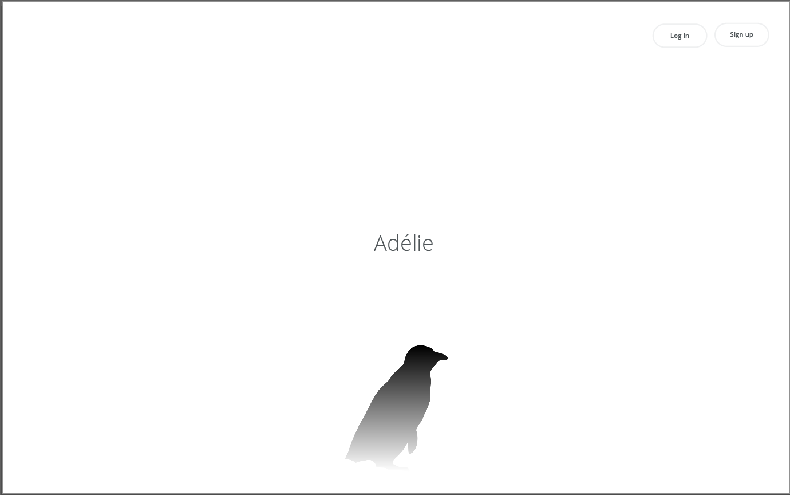
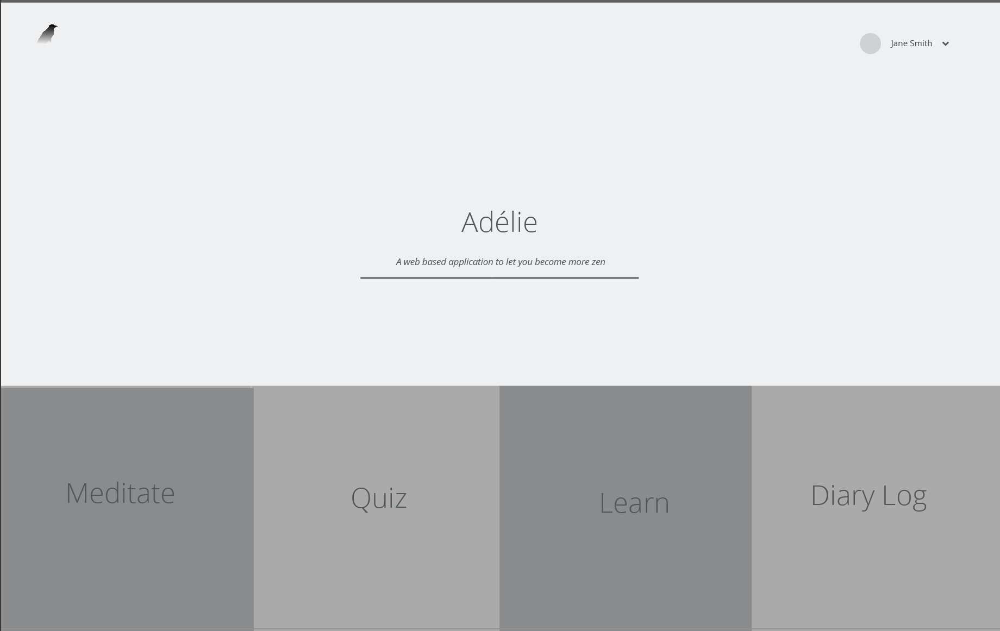
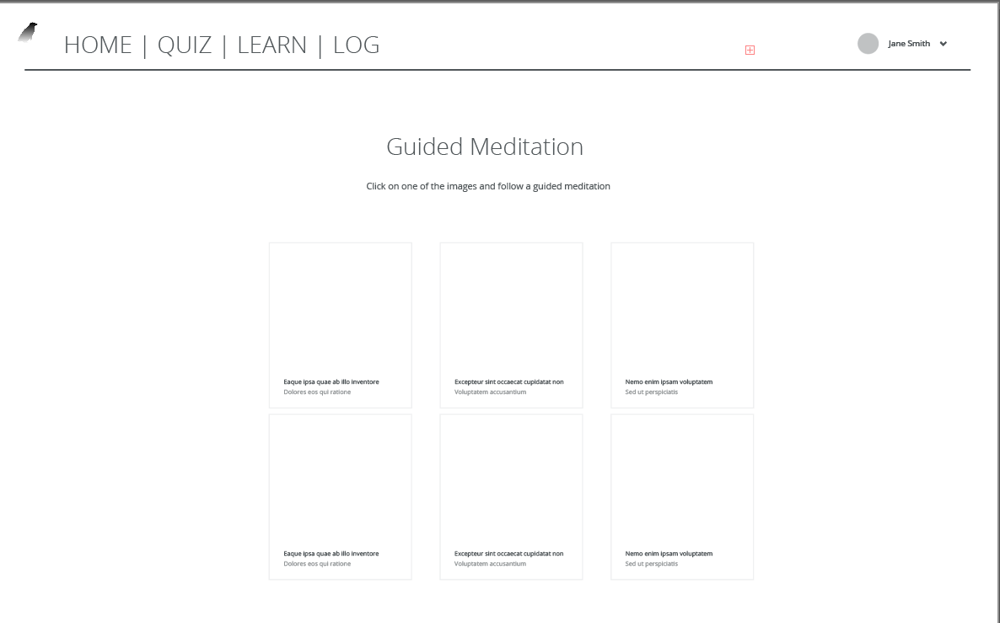
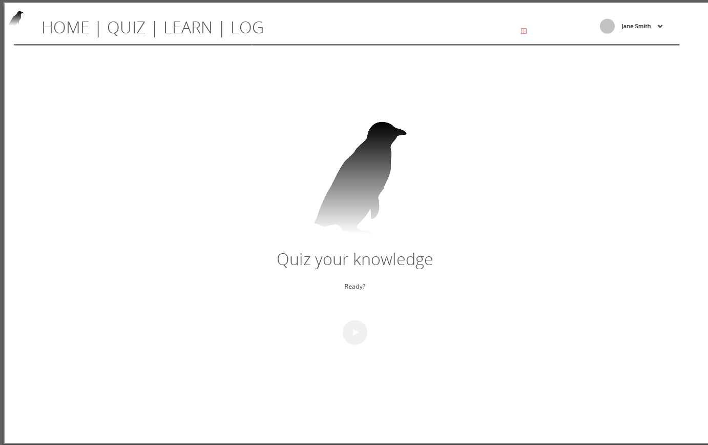
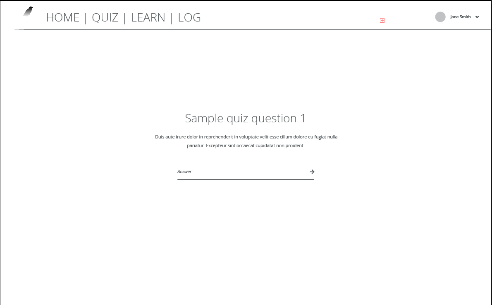
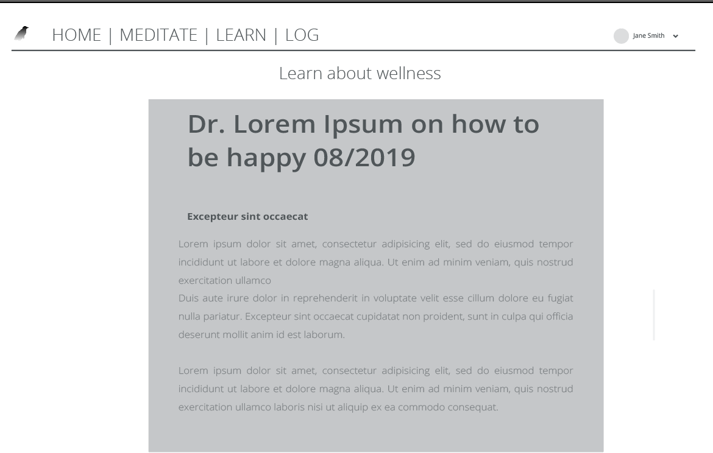
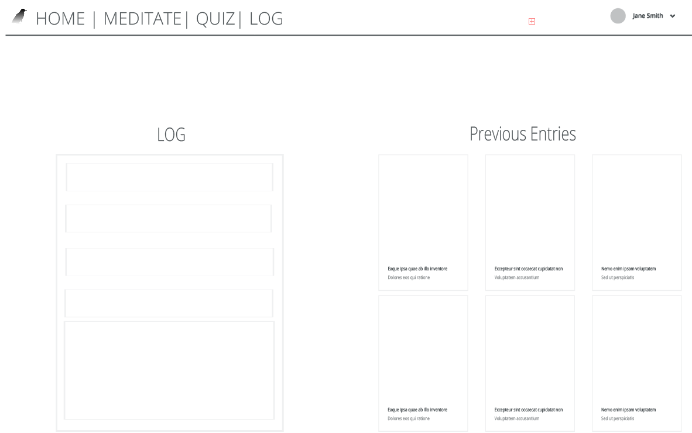

The content below is an example project proposal / requirements document. Replace the text below the lines marked "__TODO__" with details specific to your project. Remove the "TODO" lines.

(Adélies: A web based application to let you become more zen)

# Adélies

## Overview
{ Become mindful of your surroundings. Learn how to focus even with background noise. Learn how to be more serene. }

This application will consist of four different sections. Logging, Learning, Practicing, and Guided Mediation.  LOG your thoughts and learn how to focus on your present-day challenges, thoughts, and behaviors. LEARN what is mindfulness and how you can apply it to your everyday life. PRACTICE what you learned by taking a quiz to test your understanding of being mindful. MEDIATE, take 10 minutes off your day and follow a guided meditation.


## Data Model

The Adélies application will store Diary Items, Blog Entries, Videos, MP3 Files, and User Identification

* users can input multiple diary entries (via mongoDB and post)
* users can learn more about wellness (via embedded external links or videos)
* users can meditate by listening to a guided meditation (via mp3 files)


User:

```javascript
{
  username: "Relaxer123",
  hash: // a password hash,
  diary: // an collection/bucket containing their data
  googleAnalytics://Embedded analytics to track user interaction
}
```

Diary Entry:

```javascript
{
  user: // a reference to a User object
  name: "Suzan's week",
  diary: [
    { Date: "2005-12-12", Thought: "I am having a hard day", WellnessLevel: 3, Wellnessmethod: "meditation", Wellnesslvelafter:7},
    { Date: "2005-13-12", Thought: "I am sad", WellnessLevel: 1, Wellnessmethod: "Reading, Music", Wellnesslvelafter: 4},    
  ],
}
```

Wellness Entry:

```javascript
{
  Author: "Dr Happy"
  name: "Suzan's week",
  Info: [
    { Date: "2005-12-12", Tile: "I love life", url:"behappy.net"},
  ],
}
```

## [Link to Commented First Draft Schema](https://github.com/nyu-csci-ua-0480-001-003-fall-2018/Rachelnarios-final-project/blob/master/src/db.js)


## Wireframes
/signup

/landing - landing page

/meditate - page to practice meditation

/practice - page to take a quiz on Wellness


/learn - page to learn more about Wellness

/diary - page to log in Diary and view past entries


## [Link to Site Map](https://github.com/nyu-csci-ua-0480-001-003-fall-2018/Rachelnarios-final-project/blob/master/documentation/site.png)


## HIGH END User Stories

1. as non-registered user, I can register a new account with the site
2. as a user, I can log in to the site so I can better my wellness
3. as a user, I can create a new diary entry so I can start accumulating data and see how I am doing
4. as a user, I can meditate by playing an mp3 file so I can feel better
5. as a user, I can take a quiz so I can see how I am doing in terms of Wellness
6. as a user, I can learn more about wellness by reading blog entries by professionals so I can become more knowledgable
7. as a user, I can watch a video on wellness so I can easily learn
8. as a developer, I can track user perfomance through google analytics so I can better the application

## Research Topics

* (3 points) Integrate user password less integration with Facebook developer API
    * I'm going to be using Facebook toolkit for user authentication
    * No Password is needed
    * Using their API is more secure than creating my own
    * see https://developers.facebook.com/docs/accountkit/webjs

* (3 points) Perform Unit Tests with mocha
    * I will do unit test based programming with mocha
    * This will Ensure nothing goes wrong based on different scenarios
    * Will help with a well rounded app
    * see https://mochajs.org/

* (3 points) Integrate Google Analytics
    * I will integrate google analytics to track user perfomance
    * This will help me track user perfomance and how the application is doing
    * Good way to provide data driven results

* 9 points


## [Link to Initial Main Project File](https://github.com/nyu-csci-ua-0480-001-003-fall-2018/Rachelnarios-final-project/blob/master/src/app.js)


## Annotations

1. Mocha Unit Test docs](https://codeburst.io/how-to-test-javascript-with-mocha-the-basics-80132324752e?gi=5afd35c56396)
2. Use Bootstrap Intro https://www.w3schools.com/bootstrap/bootstrap_get_started.asp
3. Google Analytics https://analytics.google.com/analytics/web/provision/?authuser=0#/provision
4. All Wireframes and logos were done with Adobe Illustrator

##Citations
1. Full page video : Code Pen: https://codepen.io/dudleystorey/pen/knqyK
